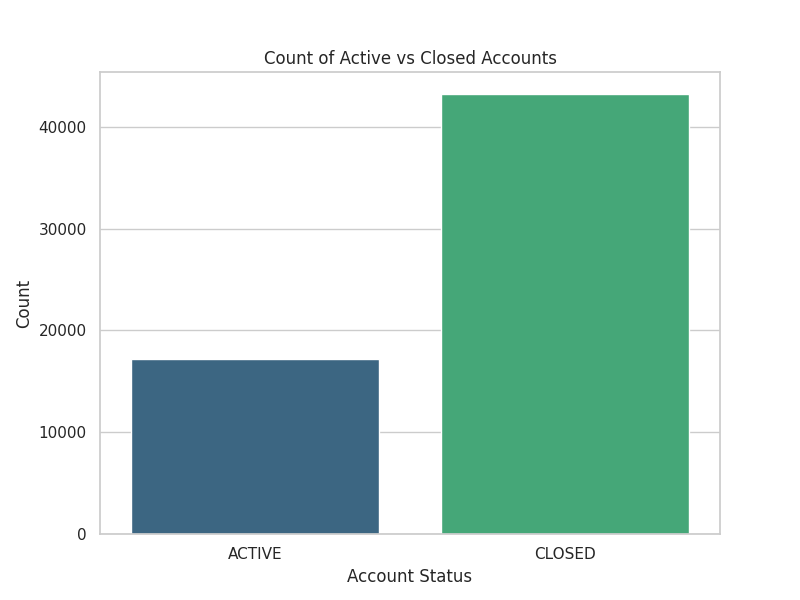
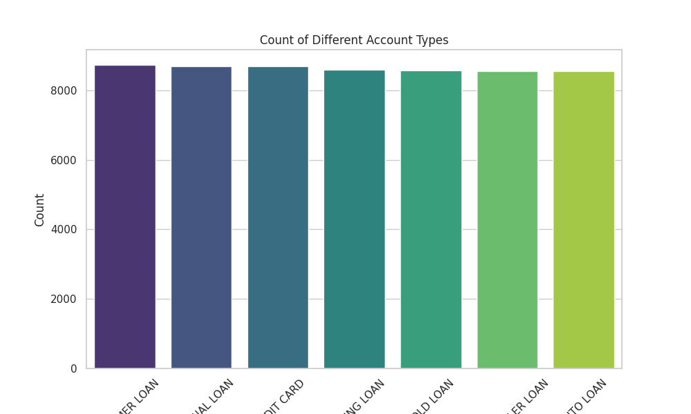
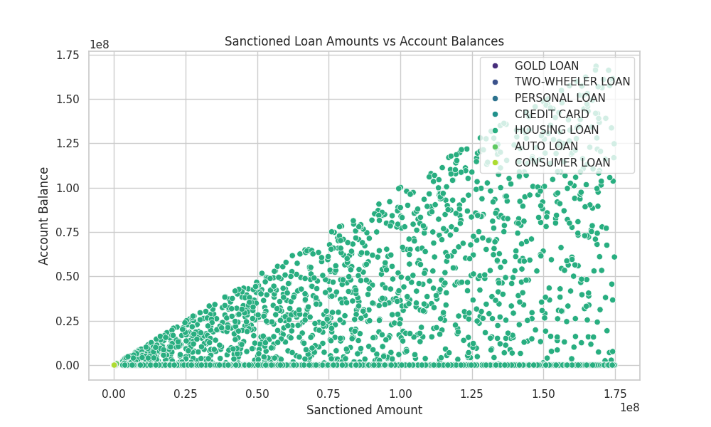
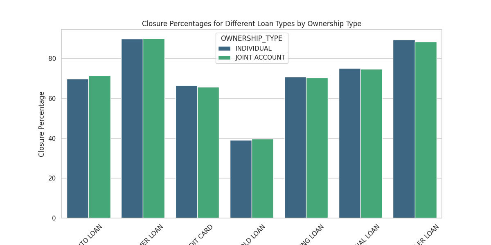
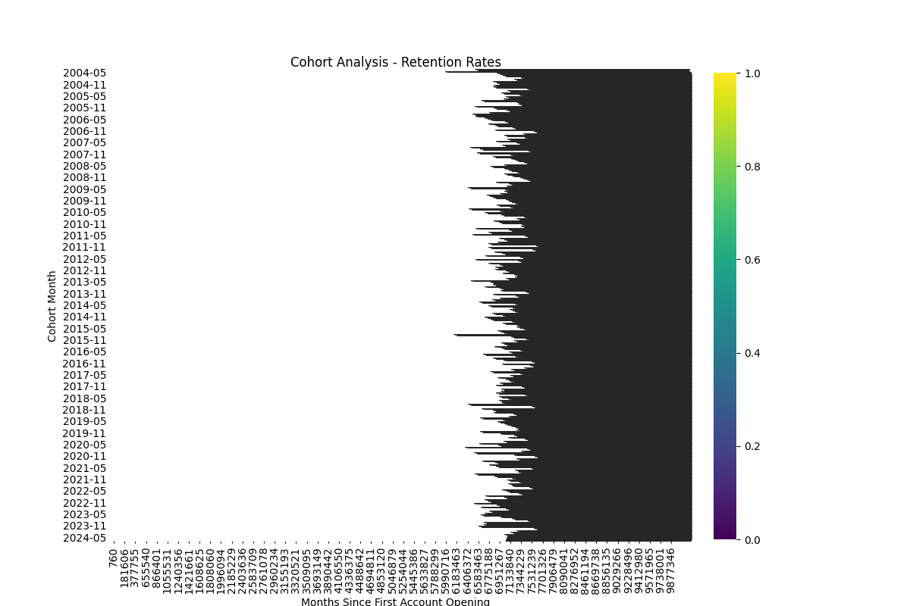

# **Report**

# Customer Segmentation Analysis

## 1. Introduction
Horizon Apex Bank, a subsidiary of Horizon Bancorp, Inc., serves both commercial and retail customers across India. The objective of this analysis is to segment the customer base to personalize marketing campaigns and improve customer engagement.

## 2. Methodology

### Data Collection
The data was collected from the `TRANSACTION_LINE` and `USER_DATA` datasets provided by Horizon Apex Bank.

### Data Cleaning and Preprocessing
- Filled missing values in the `CLOSED_DATE` column with a placeholder date.
- Converted date columns (`OPENING_DATE`, `LAST_PAYMENT_DATE`, `CLOSED_DATE`) to datetime objects.
- Removed duplicate entries.
- Normalized categorical data by stripping and converting to uppercase.

### Exploratory Data Analysis (EDA)
Conducted EDA to understand the distribution of account statuses, account types, loan amounts, and account balances.

### Customer Segmentation
- Segmented customers based on FICO scores.
- Categorized customers by the types of accounts they hold.
- Segmented customers by the status of their accounts (active or closed).

### Cohort Analysis
Performed cohort analysis to understand customer retention rates over time by grouping customers based on their account opening dates.

### Cross-Selling Opportunities
Identified potential cross-selling opportunities by analyzing common account combinations held by customers.

## 3. Key Findings

### Summary of Active vs Closed Accounts

### Breakdown of Account Types

### Analysis of Loan Amounts vs Account Balances

### Closure Percentages by Ownership Type

### Customer Segmentation by FICO Score
Customers were segmented into the following categories based on their FICO scores:
- Poor: 300-579
- Fair: 580-669
- Good: 670-739
- Very Good: 740-799
- Exceptional: 800-850

### Cohort Analysis Results

### Cross-Selling Opportunities
Identified common account combinations and potential cross-selling products. Detailed analysis and common combinations are available in the report.

## 4. Recommendations

### Personalized Marketing Strategies
- Develop targeted marketing campaigns for each customer segment based on their FICO scores and product usage.
- Use customer segmentation data to tailor communication and offers to different groups.

### Enhancing Customer Engagement
- Implement personalized engagement strategies to retain customers and reduce account closure rates.
- Offer incentives and rewards for maintaining accounts and timely payments.

### Potential Cross-Selling Products
- Identify and offer relevant products to customers based on their current holdings and behavior patterns.
- Focus on customers with multiple account types for cross-selling opportunities.

## 5. Visual Aids
The following visualizations are included in this report to present the data clearly and effectively:

- **Summary of Active vs Closed Accounts**

- **Breakdown of Account Types**

- **Analysis of Loan Amounts vs Account Balances**

- **Closure Percentages by Ownership Type**

- **Cohort Analysis Results**

---

The analysis and visualizations presented in this report provide valuable insights into customer behavior and opportunities for personalized marketing and customer engagement. By implementing the recommendations, Horizon Apex Bank can improve its marketing strategies, enhance customer satisfaction, and identify potential cross-selling opportunities.
