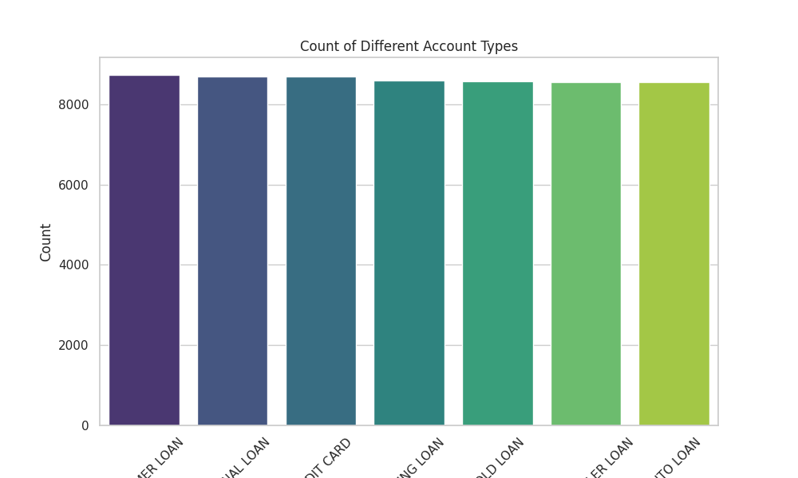
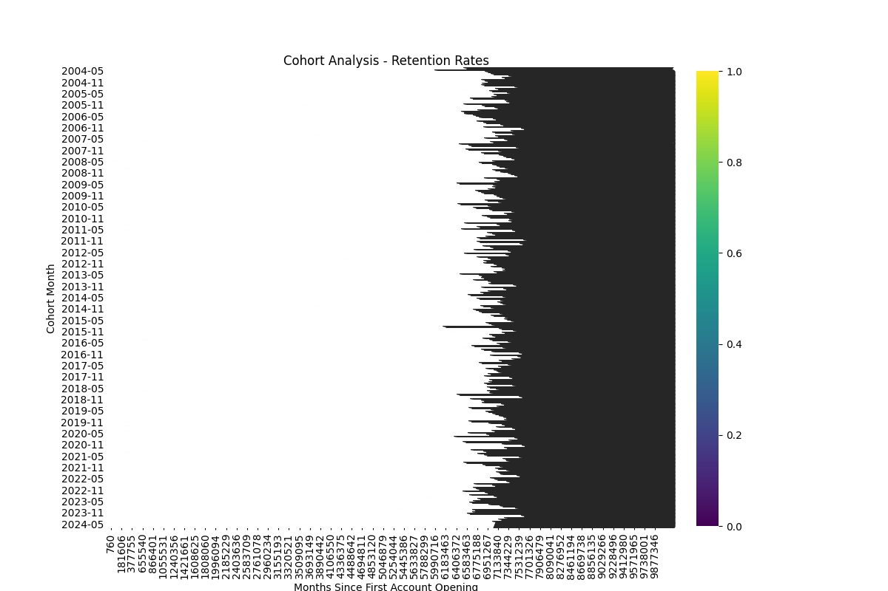

# Horizon Apex Bank Customer Segmentation Analysis

## 1. Introduction
Horizon Apex Bank, a subsidiary of Horizon Bancorp, Inc., serves both commercial and retail customers across India. The objective of this analysis is to segment the customer base to personalize marketing campaigns and improve customer engagement.

## 2. Methodology
### Data Collection
The data was collected from the `TRANSACTION_LINE` and `USER_DATA` datasets provided by Horizon Apex Bank.

### Data Cleaning and Preprocessing
The data was cleaned by filling missing values, converting date columns to datetime objects, removing duplicates, and normalizing categorical data.

### Exploratory Data Analysis (EDA)
EDA was conducted to understand the distribution of account statuses, account types, loan amounts, and account balances.

### Customer Segmentation
Customers were segmented based on FICO scores, product usage, and account activity.

### Cohort Analysis
Cohort analysis was performed to understand customer retention rates over time.

### Cross-Selling Opportunities
Cross-selling opportunities were identified by analyzing common account combinations held by customers.

## 3. Key Findings
### Summary of Active vs Closed Accounts

### Breakdown of Account Types

### Analysis of Loan Amounts vs Account Balances

### Closure Percentages by Ownership Type

### Customer Segmentation by FICO Score
Customers were segmented based on their FICO scores into categories such as Poor, Fair, Good, Very Good, and Exceptional.

### Cohort Analysis Results

### Cross-Selling Opportunities
Common account combinations and potential cross-selling products were identified.

## 4. Recommendations
- Implement personalized marketing strategies based on customer segments.
- Enhance customer engagement through targeted communication.
- Explore cross-selling opportunities for products that are commonly held together by customers.

## 5. Visual Aids
Charts and graphs are provided throughout the report to present the data clearly and effectively.

